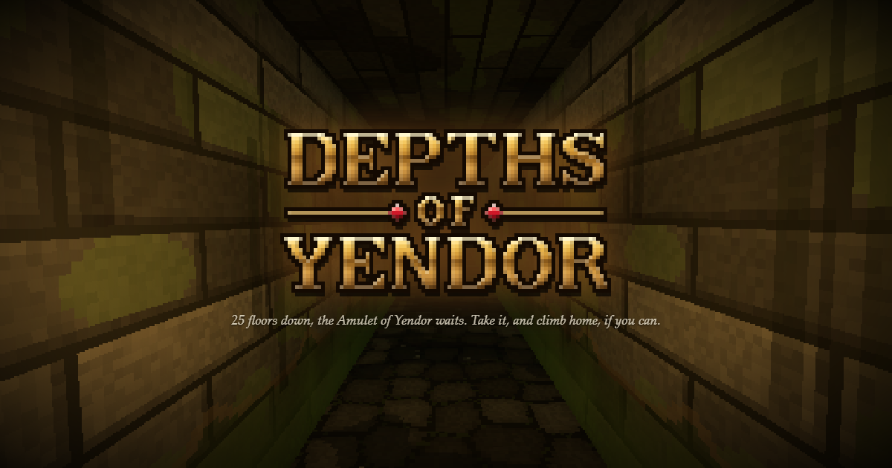

<p align="center">
  
</p>

# Depths of Yendor

A first-person, real-time roguelike for the browser, in the spirit of **King's Field** (slow, deliberate melee in dark stone corridors) crossed with **Rogue** and **Pixel Dungeon** (procedural floors, unidentified items, curses, permadeath).

Descend 25 floors and take the **Amulet of Yendor** from its Warden. Then choose: invoke the Amulet and escape at once, or carry it back up through every floor to the surface for double score while the dungeon throws everything it has at you.

### [▶ Play it in your browser](https://astrodogedx.github.io/Depths-of-Yendor/)

No install needed: it runs in any modern desktop browser, with a keyboard and mouse. Your run saves as you go, so you can close the tab and pick it up later.

## Features

- **25 floors in five themes:** the Sewers, the Catacombs, the Caves, the Dwarven Ruins and the Underworld, each with its own look, sounds, doors, stairs, furnishings and hazards: water channels, spike pits, chasms, rifts and lava. Every floor is generated from a seed, and seeds can be shared.
- **Rogue in real time:** an attack meter instead of turns, monsters that telegraph their blows so you can step out of reach, and sneak attacks on sleeping or unaware monsters. Monsters see you and hear your footsteps, so sprinting is fast but loud, and sneaking is slow but near-silent.
- **13 monsters,** from rats and oozes to trolls, stone golems and the Warden of Yendor, each with its own strengths and weaknesses: a mace is the answer to skeletons, fire is the troll's bane. Some of the chests are mimics.
- **Unidentified items:** potions, scrolls, wands and rings look different every run, so you learn what they do by using them. Some equipment is cursed, and won't come off.
- **Loot and gear:** weapons you can grip in one hand or two, shields to raise against blows, bows and arrows, armour, potions, scrolls, wands, rings and food, mostly found in chests, the best in locked ones. Artefacts of power wait in guarded shrines, and a shop opens on the first floor of each theme after the first.
- **Traps, locked rooms and keys,** and floors that stay as you left them when you go back up.
- **Made in code:** the dungeon, its textures and the sound are all generated, and the models are [Blockbench](https://www.blockbench.net) projects built by code too.

## How to play

| Key | Action |
| --- | --- |
| WASD / arrows | Move (← → turn) |
| Mouse | Look (click the view to capture the pointer) |
| Click / Space | Attack: a full meter hits hardest (with a bow in hand, jab with an arrow) |
| Shift | Sprint: fast, but loud |
| C | Sneak: slow and near-silent, for sneak attacks and creeping over traps you've found |
| E | Pick up, open a chest or door, buy, use stairs |
| I or Tab | Your pack |
| M | Map |
| 1–4 | Hotbar: scrolls and food are used at once; hold the key for a potion or wand, then click to throw or zap it, or right-click to drink it or zap yourself. A weapon, lantern, shield or bow there swaps into your hand |
| F | Grip your weapon in both hands, or one (with a bow, change between your bow and your weapon) |
| Right-click | Hold to raise your shield (click to shove with it), or nock an arrow to your bow (hold click to draw, let go to shoot) |
| Q | Drink a potion you know is healing |
| R / T | Artefact powers |
| P | Pixel size |
| Esc | Pause, or save and quit |

**How to play** on the title screen covers the same, and a little lore. For every rule in detail, see [Gameplay](docs/gameplay.md).

## Running it yourself

You'll need [Node.js](https://nodejs.org).

```sh
npm install
npm run dev        # play at http://localhost:5173, with the dev tools (the ` key)
npm run build      # a static build in dist/, which works from any folder on any static host
npm run preview    # serve that build locally
```

Pushing to `master` publishes the game to GitHub Pages. See [Development](docs/development.md) for more.

## Built with

- [three.js](https://threejs.org) for the 3D, in plain ES modules
- [Vite](https://vite.dev) to serve and build it
- [Blockbench](https://www.blockbench.net) models, built from code by `tools/modelgen/`
- The Web Audio API for its synthesised sound

## Development docs

The details of how everything works are in [`docs/`](docs/README.md):

- [Development](docs/development.md): building and publishing, the dev tools, and a map of the code
- [Gameplay](docs/gameplay.md): controls and every rule in full
- [The dungeon](docs/dungeon.md): the themes and how floors are generated
- [Blockbench models](docs/models.md): the models and the conventions the game relies on

The game is a work in progress: for now the boss floors between themes are built like any other floor, except the last.

## License

[MIT](LICENSE) © 2026 AstroDogeDX
